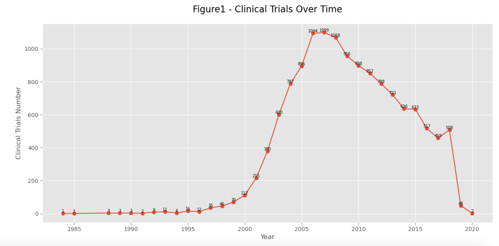
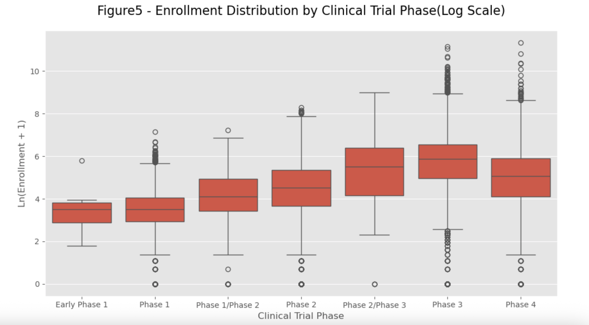
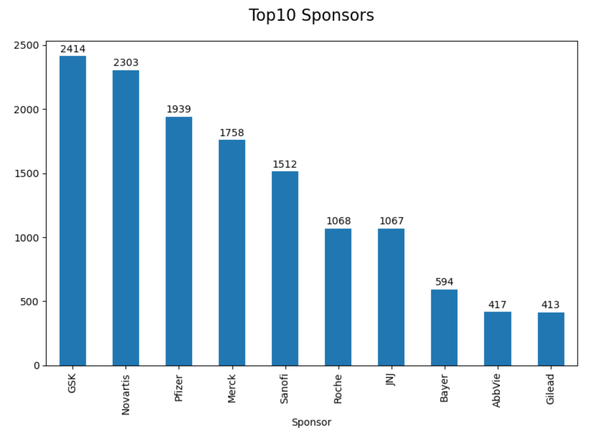
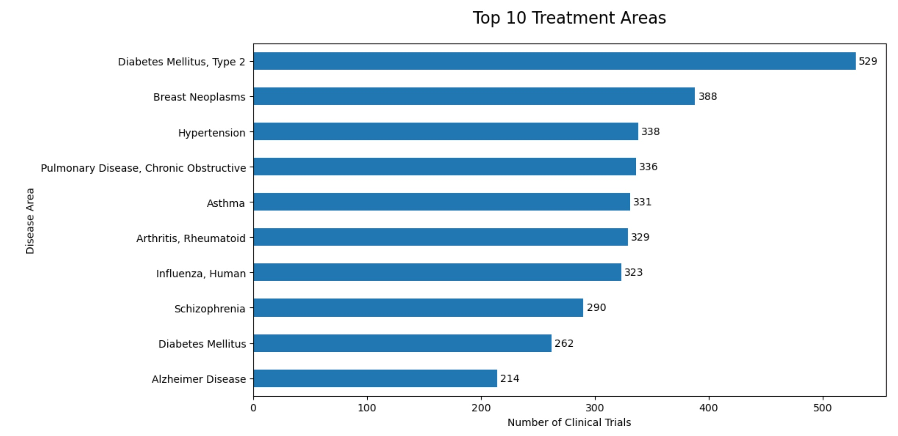
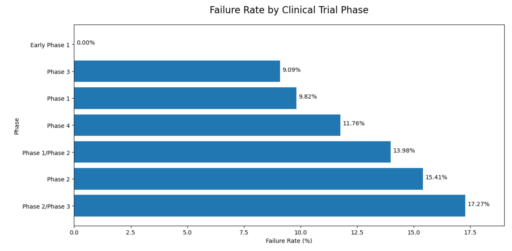
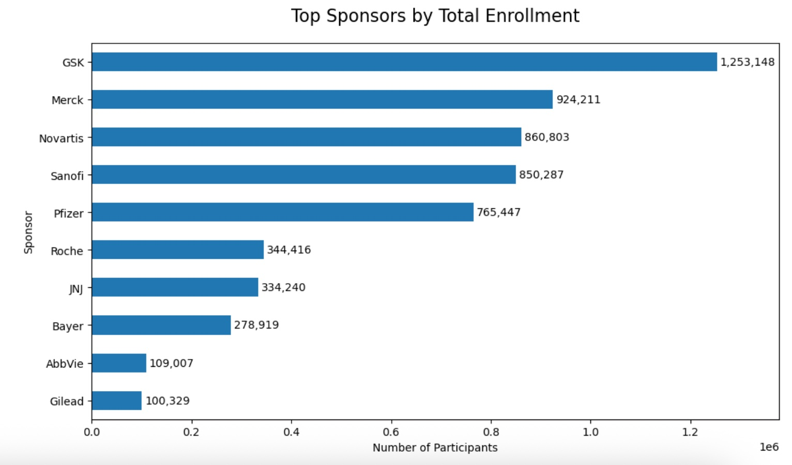
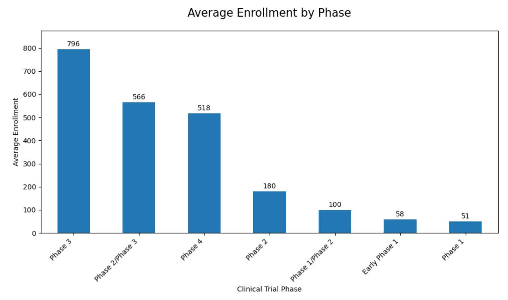
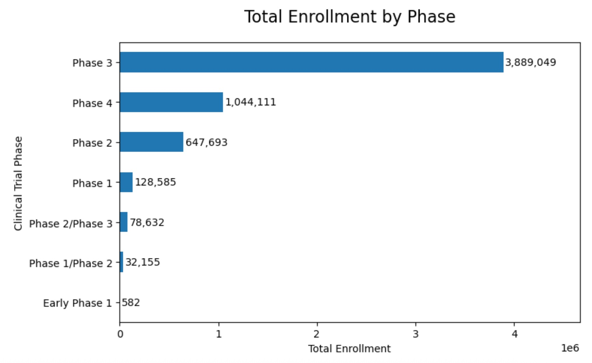

# Global Clinical Trial Analytics Report

## Executive Summary

This project analyzes 13,485 clinical trials conducted between 1984 and 2020. Using SQL, Python, and data visualization techniques, the analysis explores sponsor activity, treatment areas, enrollment patterns, and trial performance across different clinical trial phases.

The findings show:
- GSK is the most active sponsor.
- Type 2 Diabetes is the most frequently studied condition.
- Phase 2/3 trials experience the highest failure rate. 
- Phase 3 studies account for both the highest average enrollment and the largest overall participant volume.

---

## 1. Dataset Overview

|        Metric         |   Value   |
| --------------------- | --------  |
| Total Clinical Trials |    13,485 |
| Total Sponsors        |        10 |
| Total Disease Areas   |       852 |
| Total Enrollment      | 5,820,807 |
| Time Period           | 1984–2020 |

The dataset contains information on clinical trial sponsors, disease conditions, enrollment counts, study phases, and trial status.

---

## 2. Exploratory Data Analysis

Before answering business questions, exploratory analysis was conducted to understand the overall trends and data distribution.

### 2.1 Clinical Trial Trend

After 2000, clinical trial activity increased significantly, peaking in the mid-2000s.

### 2.2 Enrollment Distribution by Phase

Later-stage clinical trials typically involve larger groups of participants and have greater variability in enrollment size.

---

## 3. Business Analysis Results

### Q1 – Most Active Sponsors

GSK conducted the highest number of clinical trials, followed by Novartis and Pfizer.

### Q2 – Most Popular Treatment Areas

Type 2 Diabetes was the most frequently studied disease area, followed by Breast Neoplasms and Hypertension.

### Q3 – Failure Rate by Phase

Phase 2/3 clinical trials had the highest failure rate, indicating a high development risk during the transition phase of clinical research and development.

### Q4 – Sponsors with Largest Enrollment

GSK enrolled more than 1.25 million participants, ranking first among all sponsors.

### Q5 – Average Enrollment by Phase

Phase 3 trials reported the highest average enrollment.

### Q6 – Total Enrollment by Phase

Phase 3 trials have the largest number of participants, indicating that this stage is the most resource-intensive in clinical development.

---

## 4. Key Findings

* GSK is the most active sponsor and enrolled the largest number of participants.
* Type 2 Diabetes is the most frequently studied treatment area.
* Phase 2/3 trials have the highest failure rate.
* Phase 3 studies involve the largest average and total participant enrollment.

---

## 5. Conclusion

This project demonstrates an end-to-end data analytics workflow, including data cleaning, SQL analysis, exploratory analysis, dashboard development, and business insight generation. The results provide a comprehensive overview of clinical trial activity and highlight key trends in sponsor behavior, disease focus, enrollment strategy, and trial performance.
